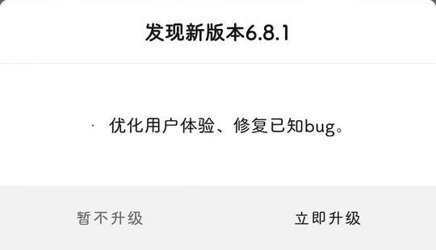

# com.xiaomi.hm.health（Zeep Life）

## 普通规则

快速复制:
```
{"popup_rules":
    [
        {"id":"发现新版本","action":"暂不升级"}
    ]
}
```
详细说明：
- [{"id":"发现新版本","action":"暂不升级"}](#id发现新版本action暂不升级)

### {"id":"发现新版本","action":"暂不升级"}
去除更新弹窗




## 增强规则
