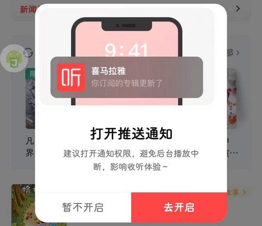
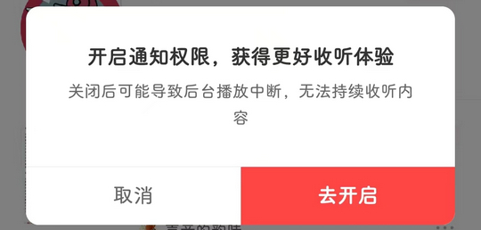
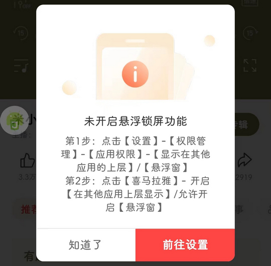
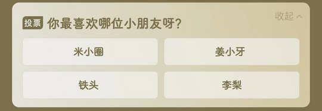
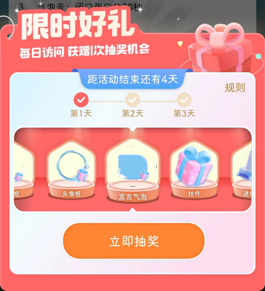
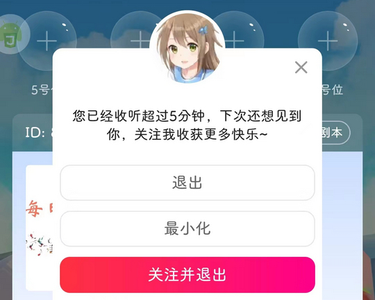

# com.ximalaya.ting.android（喜马拉雅）

## 基础规则

快速复制:
```
{"popup_rules":
    [
        {"id":"打开推送通知","action":"暂不开启"},
        {"id":"开启通知权限","action":"取消"},
        {"id":"打开通知权限","action":"暂不开启"},
        {"id":"main_iv_limit_confirm","action":"main_iv_limit_close"},
        {"id":"host_lockscreen_guide_alert_dialog_rich_confirm_title_tv","action":"host_lockscreen_guide_alert_dialog_rich_confirm_cancel_btn"},
        {"id":"host_layout_vote_title","action":"host_timeline_card_close"},
        {"id":"main_x_play_anchor_shop_cover","action":"main_x_play_anchor_shop_close_btn"},
        {"id":"live_iv_bottom_close","action":"live_iv_bottom_close"},
        {"id":"立即抽奖","action":"GLOBAL_ACTION_BACK"},
        {"id":"有通行证奖励可领取","action":"引导关闭按钮"},
        {"id":"liveExitDialogBg","action":"liveBtnExit"},
        {"id":"main_ad_broadside_img","action":"main_ad_broadside_close"}
    ]
}
```
详细说明：
- [{"id":"打开推送通知","action":"暂不开启"}](#id打开推送通知action暂不开启)
- [{"id":"开启通知权限","action":"取消"}](#id开启通知权限action取消)
- [{"id":"打开通知权限","action":"暂不开启"}](#id打开通知权限action暂不开启)
- [{"id":"main_iv_limit_confirm","action":"main_iv_limit_close"}](#idmain_iv_limit_confirmactionmain_iv_limit_close)
- [{"id":"host_lockscreen_guide_alert_dialog_rich_confirm_title_tv","action":"host_lockscreen_guide_alert_dialog_rich_confirm_cancel_btn"}](#idhost_lockscreen_guide_alert_dialog_rich_confirm_title_tvactionhost_lockscreen_guide_alert_dialog_rich_confirm_cancel_btn)
- [{"id":"host_layout_vote_title","action":"host_timeline_card_close"}](#idhost_layout_vote_titleactionhost_timeline_card_close)
- [{"id":"main_x_play_anchor_shop_cover","action":"main_x_play_anchor_shop_close_btn"}](#idmain_x_play_anchor_shop_coveractionmain_x_play_anchor_shop_close_btn)
- [{"id":"live_iv_bottom_close","action":"live_iv_bottom_close"}](#idlive_iv_bottom_closeactionlive_iv_bottom_close)
- [{"id":"立即抽奖","action":"GLOBAL_ACTION_BACK"}](#id立即抽奖actionglobal_action_back)
- [{"id":"有通行证奖励可领取","action":"引导关闭按钮"}](#id有通行证奖励可领取action引导关闭按钮)
- [{"id":"liveExitDialogBg","action":"liveBtnExit"}](#idliveexitdialogbgactionlivebtnexit)
- [{"id":"main_ad_broadside_img","action":"main_ad_broadside_close"}](#idmain_ad_broadside_imgactionmain_ad_broadside_close)

### {"id":"打开推送通知","action":"暂不开启"}
关闭打开推送通知弹窗



### {"id":"开启通知权限","action":"取消"}
关闭开启通知权限弹窗



### {"id":"打开通知权限","action":"暂不开启"}
关闭打开通知权限弹窗


### {"id":"main_iv_limit_confirm","action":"main_iv_limit_close"}
关闭红包弹窗

### {"id":"host_lockscreen_guide_alert_dialog_rich_confirm_title_tv","action":"host_lockscreen_guide_alert_dialog_rich_confirm_cancel_btn"}
关闭 “开启悬浮窗锁屏功能” 弹窗



### {"id":"host_layout_vote_title","action":"host_timeline_card_close"}
关闭播放页面上方投票信息



### {"id":"main_x_play_anchor_shop_cover","action":"main_x_play_anchor_shop_close_btn"}
关闭播放页面右侧悬浮广告


### {"id":"live_iv_bottom_close","action":"live_iv_bottom_close"}
关闭直播界面首充弹窗


### {"id":"立即抽奖","action":"GLOBAL_ACTION_BACK"}
关闭直播界面限时好礼抽奖弹窗



### {"id":"有通行证奖励可领取","action":"引导关闭按钮"}
关闭直播界面左侧 “通行证奖励领取” 悬浮广告


### {"id":"liveExitDialogBg","action":"liveBtnExit"}
关闭直播界面退出时的引导关注弹窗



### {"id":"main_ad_broadside_img","action":"main_ad_broadside_close"}
关闭右侧悬浮广告


## 增强规则
