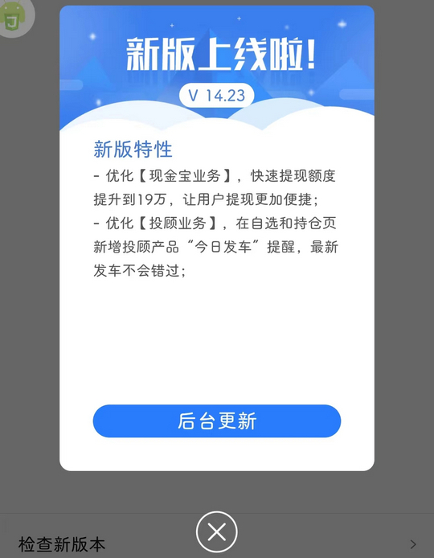
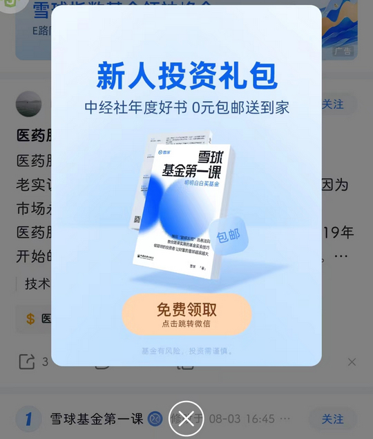

# com.xueqiu.android（雪球）

## 基础规则

快速复制:
```
{"popup_rules":
    [
        {"id":"update_content","action":"image_cancel"},
        {"id":"iv_notice","action":"ib_close"}
    ]
}
```
详细说明：
- [{"id":"update_content","action":"image_cancel"}](#idupdate_contentactionimage_cancel)
- [{"id":"iv_notice","action":"ib_close"}](#idiv_noticeactionib_close)

### {"id":"update_content","action":"image_cancel"}
关闭更新弹窗



### {"id":"iv_notice","action":"ib_close"}
关闭新人投资礼包弹窗




## 增强规则
