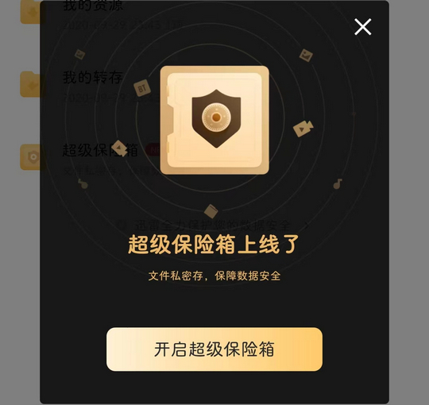
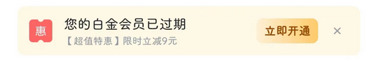
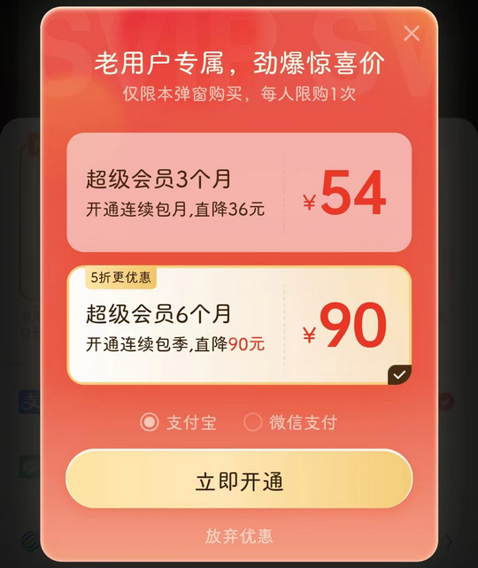
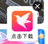
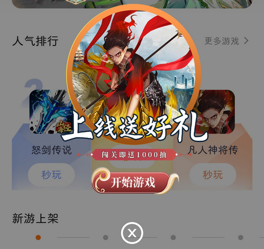
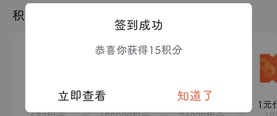

# com.xunlei.downloadprovider（迅雷）

## 基础规则

快速复制:
```
{"popup_rules":
    [
        {"id":"开启超级保险箱","action":"close"},

        {"id":"touch_bottom_bar_bubble_main_title_tv","action":"touch_bottom_bar_bubble_close_iv"},

        {"id":"touch_dlg_main_title_tv","action":"touch_dlg_close_iv"},

        {"id":"touch_dlg_main_title_tv","action":"close_btn"},

        {"id":"移动积分别浪费，迅雷会员抢先兑","action":"放弃支付"},

        {"id":"老用户专属，劲爆惊喜价","action":"放弃优惠"},

        {"id":"xl_download_guide_tip_close","action":"xl_download_guide_tip_close"},

        {"id":"close-circle","action":"close-circle"},

        {"id":"签到成功","action":"知道了"},
        
        {"id":"tv_notification_title","action":"iv_notification_tips_close"},

        {"id":"立即签到","action":"iv_close"},

        {"id":"hermes_ad_banner_recycler","action":"hermes_ad_banner_negative"},
        {"id":"feedback_not_interested_text","action":"不感兴趣"}
    ]
}
```
详细说明：
- [{"id":"开启超级保险箱","action":"close"}](#id开启超级保险箱actionclose)
- [{"id":"touch_bottom_bar_bubble_main_title_tv","action":"touch_bottom_bar_bubble_close_iv"}](#idtouch_bottom_bar_bubble_main_title_tvactiontouch_bottom_bar_bubble_close_iv)
- [{"id":"touch_dlg_main_title_tv","action":"touch_dlg_close_iv"}](#idtouch_dlg_main_title_tvactiontouch_dlg_close_iv)
- [{"id":"touch_dlg_main_title_tv","action":"close_btn"}](#idtouch_dlg_main_title_tvactionclose_btn)
- [{"id":"移动积分别浪费，迅雷会员抢先兑","action":"放弃支付"}](#id移动积分别浪费迅雷会员抢先兑action放弃支付)
- [{"id":"老用户专属，劲爆惊喜价","action":"放弃优惠"}](#id老用户专属劲爆惊喜价action放弃优惠)
- [{"id":"xl_download_guide_tip_close","action":"xl_download_guide_tip_close"}](#idxl_download_guide_tip_closeactionxl_download_guide_tip_close)
- [{"id":"close-circle","action":"close-circle"}](#idclose-circleactionclose-circle)
- [{"id":"签到成功","action":"知道了"}](#id签到成功action知道了)
- [{"id":"tv_notification_title","action":"iv_notification_tips_close"}](#idtv_notification_titleactioniv_notification_tips_close)
- [{"id":"立即签到","action":"iv_close"}](#id立即签到actioniv_close)
- [{"id":"hermes_ad_banner_recycler","action":"hermes_ad_banner_negative"} - {"id":"feedback_not_interested_text","action":"不感兴趣"}](#idhermes_ad_banner_recycleractionhermes_ad_banner_negative---idfeedback_not_interested_textaction不感兴趣)

### {"id":"开启超级保险箱","action":"close"}
关闭 “开启超级保险箱” 弹窗



### {"id":"touch_bottom_bar_bubble_main_title_tv","action":"touch_bottom_bar_bubble_close_iv"}
关闭 “云盘” 页面底部 “超值特惠” 广告



### {"id":"touch_dlg_main_title_tv","action":"touch_dlg_close_iv"}
关闭会员已过期弹窗-1


### {"id":"touch_dlg_main_title_tv","action":"close_btn"}
关闭会员已过期弹窗-2


### {"id":"移动积分别浪费，迅雷会员抢先兑","action":"放弃支付"}
关闭 “移动积分兑会员” 弹窗

⚡ 需要手动触发


### {"id":"老用户专属，劲爆惊喜价","action":"放弃优惠"}
关闭 “超级会员老用户” 专属弹窗

⚡ 需要手动触发



### {"id":"xl_download_guide_tip_close","action":"xl_download_guide_tip_close"}
关闭 “迅雷直播” 页面下载悬浮窗



### {"id":"close-circle","action":"close-circle"}
关闭 “游戏” 页面弹窗广告

⚡ 需要手动触发



### {"id":"签到成功","action":"知道了"}
关闭 “签到成功” 弹窗



### {"id":"tv_notification_title","action":"iv_notification_tips_close"}
关闭开启通知权限提示信息


### {"id":"立即签到","action":"iv_close"}
关闭直播页面签到弹窗


### {"id":"hermes_ad_banner_recycler","action":"hermes_ad_banner_negative"} - {"id":"feedback_not_interested_text","action":"不感兴趣"}
**联合规则**：关闭视频播放页banner广告


## 增强规则
