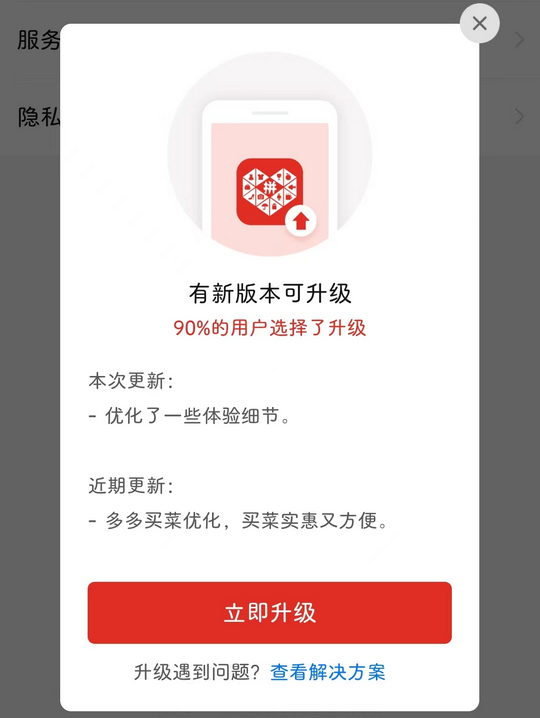

# com.xunmeng.pinduoduo（拼多多）

## 普通规则

快速复制:
```
{"popup_rules":
    [
        {"id":"新版本&升级","action":"GLOBAL_ACTION_BACK"},
        {"id":"感兴趣商品再试一件","action":"关闭弹窗"}
    ]
}
```
详细说明：
- [{"id":"新版本&升级","action":"GLOBAL_ACTION_BACK"}](#id新版本升级actionglobal_action_back)
- [{"id":"感兴趣商品再试一件","action":"关闭弹窗"}](#id感兴趣商品再试一件action关闭弹窗)

### {"id":"新版本&升级","action":"GLOBAL_ACTION_BACK"}
去除 “版本更新” 弹窗



### {"id":"感兴趣商品再试一件","action":"关闭弹窗"}
去除 “感兴趣商品再试一件” 弹窗


## 增强规则

