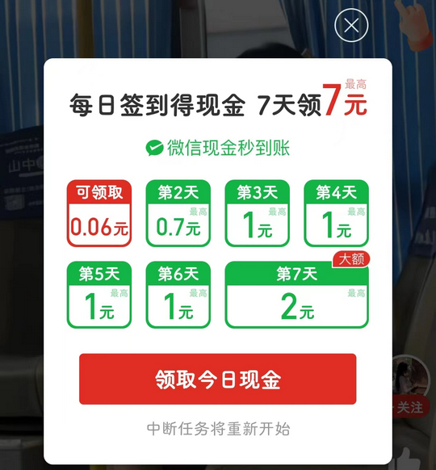

# com.xunmeng.pinduoduo（拼多多）

⚠ 该 App 内部控件标识无法明确区分，因此对其适配极其有限。

## 普通规则

快速复制:
```
{"popup_rules":
    [
        {"id":"新版本&升级","action":"GLOBAL_ACTION_BACK"},
        {"id":"青少年模式","action":"我知道了"},
        {"id":"感兴趣商品再试一件","action":"关闭弹窗"},
        {"id":"专属现金红包","action":"GLOBAL_ACTION_BACK"},
        {"id":"每日签到得现金","action":"GLOBAL_ACTION_BACK"},
        {"id":"满&元可用&优惠券","action":"GLOBAL_ACTION_BACK"}
    ]
}
```
详细说明：
- [{"id":"新版本&升级","action":"GLOBAL_ACTION_BACK"}](#id新版本升级actionglobal_action_back)
- [{"id":"青少年模式","action":"我知道了"}](#id青少年模式action我知道了)
- [{"id":"感兴趣商品再试一件","action":"关闭弹窗"}](#id感兴趣商品再试一件action关闭弹窗)
- [{"id":"专属现金红包","action":"GLOBAL_ACTION_BACK"}](#id专属现金红包actionglobal_action_back)
- [{"id":"每日签到得现金","action":"GLOBAL_ACTION_BACK"}](#id每日签到得现金actionglobal_action_back)
- [{"id":"满&元可用&优惠券","action":"GLOBAL_ACTION_BACK"}](#id满元可用优惠券actionglobal_action_back)

### {"id":"新版本&升级","action":"GLOBAL_ACTION_BACK"}
关闭 “版本更新” 弹窗


### {"id":"青少年模式","action":"我知道了"}
关闭 “青少年模式” 弹窗


### {"id":"感兴趣商品再试一件","action":"关闭弹窗"}
关闭 “感兴趣商品再试一件” 弹窗


### {"id":"专属现金红包","action":"GLOBAL_ACTION_BACK"}
关闭 “专属现金红包” 弹窗


### {"id":"每日签到得现金","action":"GLOBAL_ACTION_BACK"}
关闭 “每日签到得现金” 弹窗



### {"id":"满&元可用&优惠券","action":"GLOBAL_ACTION_BACK"}
关闭 “天降红包” 弹窗


## 增强规则

