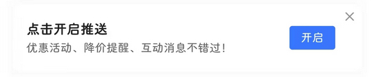

# com.yiche.autoeasy（易车）

## 普通规则

快速复制:
```
{"popup_rules":
    [
        {"id":"tv_notify_title","action":"iv_close"},
        {"id":"签到&天&获得&车币","action":"GLOBAL_ACTION_BACK"},
        {"id":"开启消息推送","action":"iv_close"}
    ]
}
```
详细说明：
- [{"id":"pop_advertisement_content","action":"iv_close"}](#idpop_advertisement_contentactioniv_close)
- [{"id":"签到&天&获得&车币","action":"GLOBAL_ACTION_BACK"}](#id签到天获得车币actionglobal_action_back)
- [{"id":"开启消息推送","action":"iv_close"}](#id开启消息推送actioniv_close)

### {"id":"tv_notify_title","action":"iv_close"}
关闭开启推送提示信息



### {"id":"签到&天&获得&车币","action":"GLOBAL_ACTION_BACK"}
关闭签到成功弹窗


### {"id":"开启消息推送","action":"iv_close"}
关闭开启推送通知弹窗


## 增强规则
