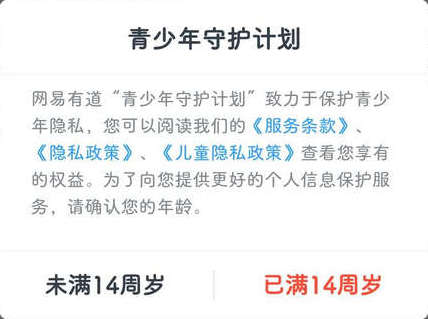
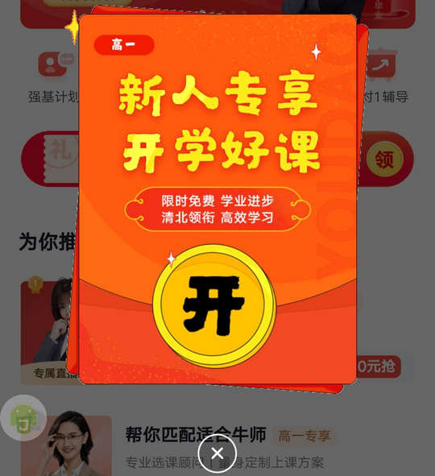
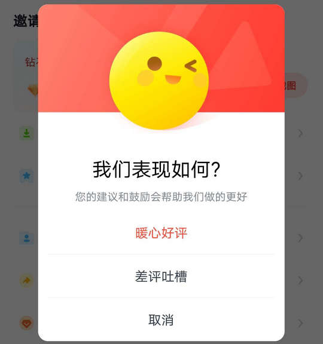

# com.youdao.course（有道精品课）

## 普通规则

快速复制:
```
{"popup_rules":
    [
        {"id":"青少年守护计划","action":"已满14周岁"},
        {"id":"banner_image","action":"iv_close"},
        {"id":"iv_float_icon","action":"iv_float_close"},
        {"id":"appraise_positive_btn","action":"appraise_cancel_btn"},
        {"id":"popWindowPic","action":"GLOBAL_ACTION_BACK"}
    ]
}
```
详细说明：
- [{"id":"青少年守护计划","action":"已满14周岁"}](#id青少年守护计划action已满14周岁)
- [{"id":"banner_image","action":"iv_close"}](#idbanner_imageactioniv_close)
- [{"id":"iv_float_icon","action":"iv_float_close"}](#idiv_float_iconactioniv_float_close)
- [{"id":"appraise_positive_btn","action":"appraise_cancel_btn"}](#idappraise_positive_btnactionappraise_cancel_btn)
- [{"id":"popWindowPic","action":"GLOBAL_ACTION_BACK"}](#idpopwindowpicactionglobal_action_back)

### {"id":"青少年守护计划","action":"已满14周岁"}
关闭青少年模式弹窗



### {"id":"banner_image","action":"iv_close"}
关闭新人专享弹窗



### {"id":"iv_float_icon","action":"iv_float_close"}
关闭首页右下方悬浮广告


### {"id":"appraise_positive_btn","action":"appraise_cancel_btn"}
关闭好评弹窗



### {"id":"popWindowPic","action":"GLOBAL_ACTION_BACK"}
关闭一键咨询弹窗

⚠ 需要手动触发


## 增强规则
