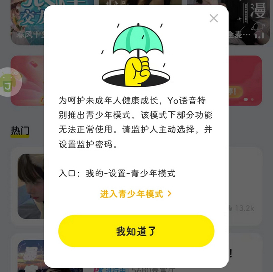

# com.yy.yomi（Yo语音）

## 基础规则

快速复制:
```
{"popup_rules":
    [
        {"id":"青少年模式","action":"我知道了"},
        {"id":"开启消息通知","action":"arg"}
    ]
}
```
详细说明：
- [{"id":"青少年模式","action":"我知道了"}](#id青少年模式action我知道了)
- [{"id":"开启消息通知","action":"arg"}](#id开启消息通知actionarg)

### {"id":"青少年模式","action":"我知道了"}
关闭青少年模式弹窗



### {"id":"开启消息通知","action":"arg"}
关闭开启消息通知提示信息


## 增强规则
