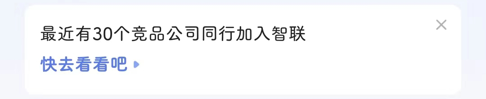
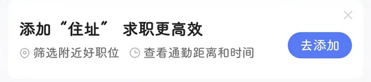

# com.zhaopin.social（智联招聘）

## 基础规则

快速复制:
```
{"popup_rules":
    [
        {"id":"rl_banner_close","action":"rl_banner_close"},
        {"id":"iv_ignore","action":"iv_ignore"},
        {"id":"ivHomeIndexItemNearbyClose","action":"ivHomeIndexItemNearbyClose"}
    ]
}
```
详细说明：
- [{"id":"rl_banner_close","action":"rl_banner_close"}](#idrl_banner_closeactionrl_banner_close)
- [{"id":"iv_ignore","action":"iv_ignore"}](#idiv_ignoreactioniv_ignore)
- [{"id":"ivHomeIndexItemNearbyClose","action":"ivHomeIndexItemNearbyClose"}](#idivhomeindexitemnearbycloseactionivhomeindexitemnearbyclose)

### {"id":"rl_banner_close","action":"rl_banner_close"}
去除 “我的” 页面中间广告


### {"id":"iv_ignore","action":"iv_ignore"}
去除 “首页” 上方 “快去看看吧” 提示信息



### {"id":"ivHomeIndexItemNearbyClose","action":"ivHomeIndexItemNearbyClose"}
去除 “首页” 上方 “添加住址” 提示信息



## 增强规则
