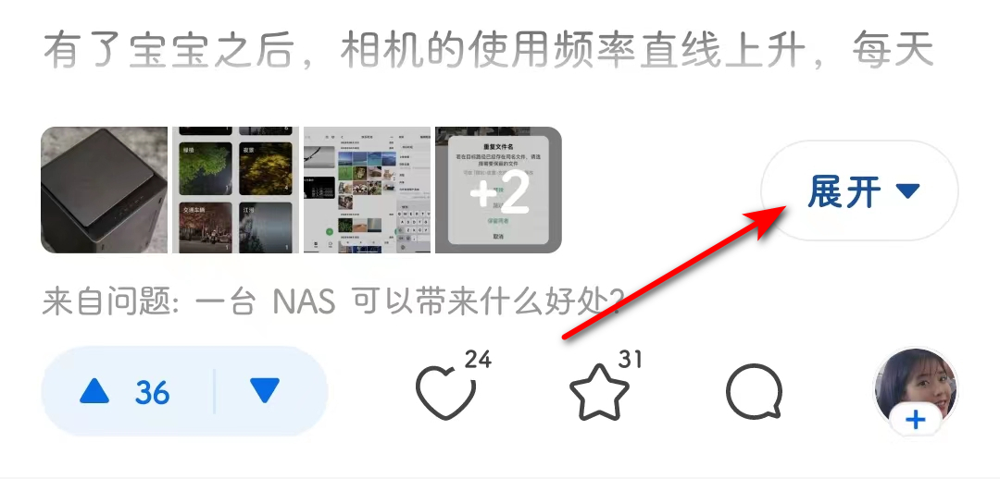

# com.zhihu.android（知乎）

## 普通规则


## 增强规则

快速复制:
```
{"popup_rules":
    [
        {"id":"tv_expand","action":"iv_expand"}
    ]
}
```
详细说明：
- [{"id":"tv_expand","action":"iv_expand"}](#idtv_expandactioniv_expand)

### {"id":"tv_expand","action":"iv_expand"}
自动展开回答（**不起作用**）


