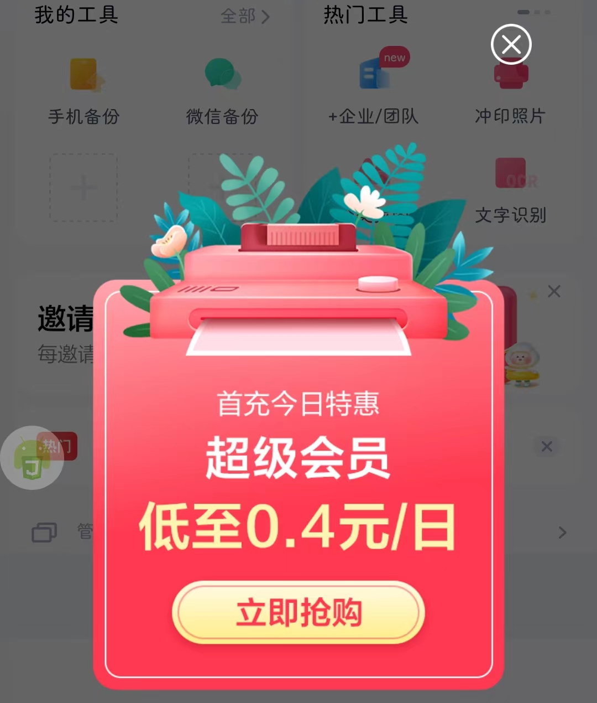
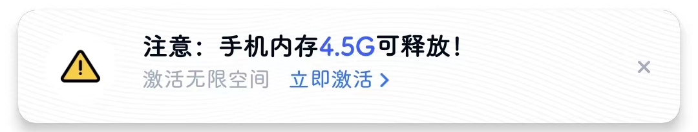
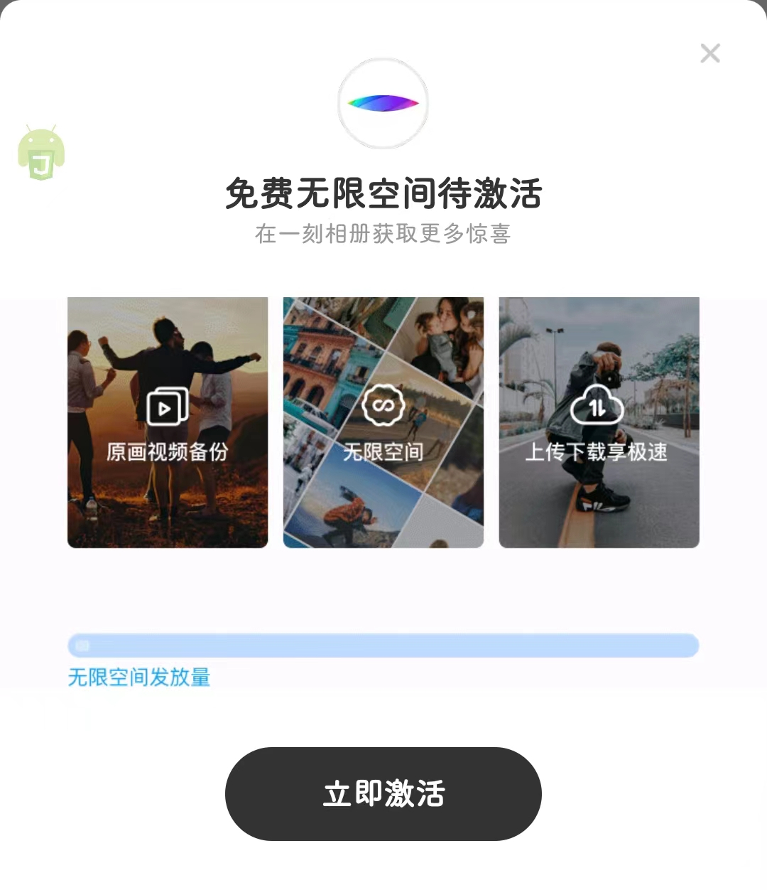

# com.baidu.netdisk（百度网盘）

## 普通规则

快速复制:
```
{"popup_rules":
    [
        {"id":"iv_close","action":"iv_close"},
        {"id":"banner_item_close","action":"banner_item_close"},
        {"id":"close","action":"close"},
        {"id":"close_clean_guide","action":"close_clean_guide"},
        {"id":"close_notification_tip","action":"close_notification_tip"},
        {"id":"iv_yike_close","action":"iv_yike_close"},
        {"id":"yike_guide_exit","action":"yike_guide_exit"}
    ]
}
```
详细说明：
- [{"id":"iv_close","action":"iv_close"}](#idiv_closeactioniv_close)
- [{"id":"banner_item_close","action":"banner_item_close"}](#idbanner_item_closeactionbanner_item_close)
- [{"id":"close","action":"close"}](#idcloseactionclose)
- [{"id":"close_clean_guide","action":"close_clean_guide"}](#idclose_clean_guideactionclose_clean_guide)
- [{"id":"close_notification_tip","action":"close_notification_tip"}](#idclose_notification_tipactionclose_notification_tip)
- [{"id":"iv_yike_close","action":"iv_yike_close"}](#idiv_yike_closeactioniv_yike_close)
- [{"id":"yike_guide_exit","action":"yike_guide_exit"}](#idyike_guide_exitactionyike_guide_exit)

### {"id":"iv_close","action":"iv_close"}
去除首页弹出“首充今日特惠”广告



### {"id":"banner_item_close","action":"banner_item_close"}
去除首页中部banner广告


### {"id":"close","action":"close"}
去除首页中部热门


### {"id":"close_clean_guide","action":"close_clean_guide"}
去除文件页面下方“开启照片自动备份”提示


### {"id":"close_notification_tip","action":"close_notification_tip"}
去除共享页面“打开通知”提示


### {"id":"iv_yike_close","action":"iv_yike_close"}
去除 首页->相册->智能分类 页面下方“激活无限空间”提示



### {"id":"yike_guide_exit","action":"yike_guide_exit"}
去除 首页->相册->智能分类 页面退出时，弹出“免费无限空间待激活”提示



## 增强规则