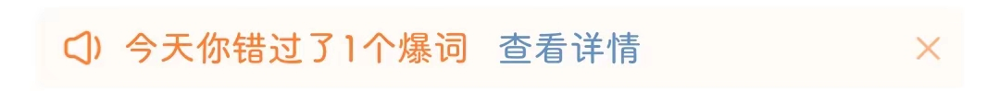

# com.sina.weibo（微博）

## 普通规则

快速复制:
```
{"popup_rules":
    [
        {"id":"bottom_process_tv","action":"close"},
        {"id":"使用您的位置信息","action":"以后再说"},
        {"id":"mIvRight","action":"mIvRight"},

        {"id":"tv_tips","action":"iv_close_icon","times":5},
        {"id":"不感兴趣&内容质量差&太多重复或相似内容","action":"不感兴趣"}
    ]
}
```
详细说明：
- [{"id":"bottom_process_tv","action":"close"}](#idbottom_process_tvactionclose)
- [{"id":"使用您的位置信息","action":"以后再说"}](#id使用您的位置信息action以后再说)
- [{"id":"mIvRight","action":"mIvRight"}](#idmivrightactionmivright)
- [{"id":"tv_tips","action":"iv_close_icon","times":5} - {"id":"不感兴趣&内容质量差&太多重复或相似内容","action":"不感兴趣"}](#idtv_tipsactioniv_close_icontimes5---id不感兴趣内容质量差太多重复或相似内容action不感兴趣)

### {"id":"bottom_process_tv","action":"close"}
去除 “首页” 页面 “刷微博领现金” 悬浮控件


### {"id":"使用您的位置信息","action":"以后再说"}
去除 “使用位置信息” 弹窗


### {"id":"mIvRight","action":"mIvRight"}
去除 “发现” 页面上方 “爆词” 信息提示



### {"id":"tv_tips","action":"iv_close_icon","times":5} - {"id":"不感兴趣&内容质量差&太多重复或相似内容","action":"不感兴趣"}

**联合规则** : 去除评论区推荐微博

⚠**注意**：此规则触发不稳定，在未自动点击评论区推荐微博右上角的 × 号时，需要您手动点击，此时会应用规则 `{"id":"不感兴趣&内容质量差&太多重复或相似内容","action":"不感兴趣"}`，自动帮您点击 “不感兴趣”


## 增强规则
