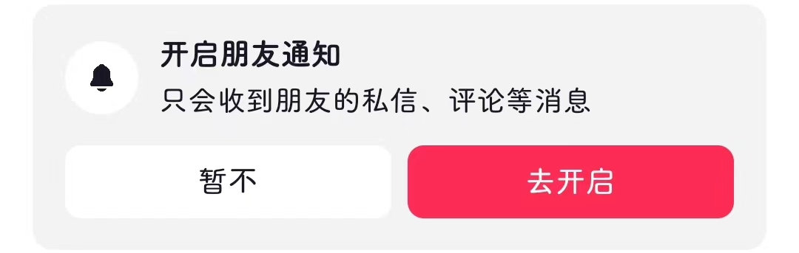
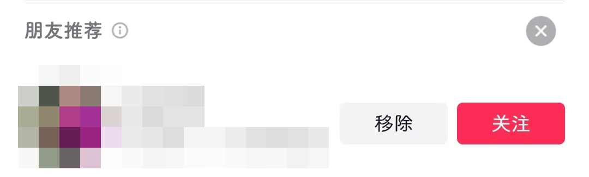

# com.ss.android.ugc.aweme（抖音）

## 去广告规则

快速复制:
```
{"popup_rules":
    [
        {"id":"boa","action":"boa"},
        {"id":"朋友推荐","action":"close"},
        {"id":"隐藏","action":"h7e"},
        {"id":"开启朋友通知","action":"暂不"},
        {"id":"朋友推荐 标题","action":"qpb"}
    ]
}
```
详细说明：
- [{"id":"boa","action":"boa"}](#idboaactionboa)
- [{"id":"朋友推荐","action":"close"}](#id朋友推荐actionclose)
- [{"id":"隐藏","action":"h7e"}](#id隐藏actionh7e)
- [{"id":"开启朋友通知","action":"暂不"}](#id开启朋友通知action暂不)
- [{"id":"朋友推荐 标题","action":"qpb"}](#id朋友推荐-标题actionqpb)

### {"id":"boa","action":"boa"}
去除首页青少年模式弹窗

### {"id":"朋友推荐","action":"close"}
去除“我的”页面朋友推荐弹窗


### {"id":"隐藏","action":"h7e"}
去除“我的”页面“您可能感兴趣”推荐信息


### {"id":"开启朋友通知","action":"暂不"}
去除“消息”页面开启朋友通知提示信息



### {"id":"朋友推荐 标题","action":"qpb"}
去除 消息->新朋友 页面朋友推荐信息



## 增强规则
