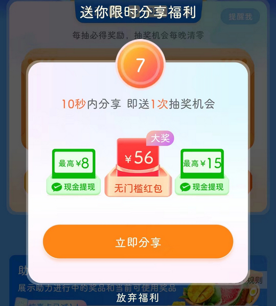
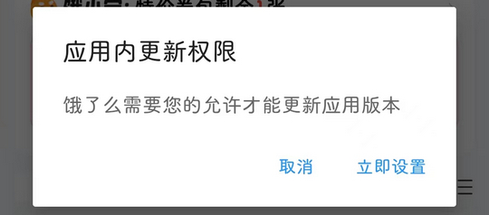

# me.ele（饿了么）

## 普通规则

快速复制:
```
{"popup_rules":
    [
        {"id":"抽奖机会","action":"放弃福利"},
        {"id":"1分钟小调研","action":"iv_cancel"},
        {"id":"应用内更新权限","action":"buttonDefaultNegative"}
    ]
}
```
详细说明：
- [{"id":"抽奖机会","action":"放弃福利"}](#id抽奖机会action放弃福利)
- [{"id":"1分钟小调研","action":"iv_cancel"}](#id1分钟小调研actioniv_cancel)
- [{"id":"应用内更新权限","action":"buttonDefaultNegative"}](#id应用内更新权限actionbuttondefaultnegative)

### {"id":"抽奖机会","action":"放弃福利"}
去除 “限时分享福利” 弹窗



### {"id":"1分钟小调研","action":"iv_cancel"}
去除 “1分钟小调研” 提示信息


### {"id":"应用内更新权限","action":"buttonDefaultNegative"}
去除应用内更新权限弹窗




## 增强规则
