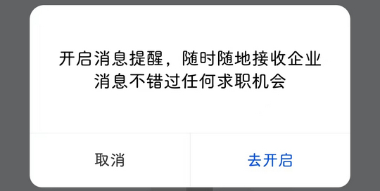

# net.unitepower.zhitong（智通人才网）

## 普通规则

快速复制:
```
{"popup_rules":
    [
        {"id":"iv_ad_img","action":"iv_close"},
        {"id":"开启消息提醒","action":"取消"},
        {"id":"tv_tips_indexNoticeMsgFragment","action":"iv_tipsClose_indexNoticeMsgFragment"}
    ]
}
```
详细说明：
- [{"id":"iv_ad_img","action":"iv_close"}](#idiv_ad_imgactioniv_close)
- [{"id":"开启消息提醒","action":"取消"}](#id开启消息提醒action取消)
- [{"id":"tv_tips_indexNoticeMsgFragment","action":"iv_tipsClose_indexNoticeMsgFragment"}](#idtv_tips_indexnoticemsgfragmentactioniv_tipsclose_indexnoticemsgfragment)

### {"id":"iv_ad_img","action":"iv_close"}
去除 “职位” 页面弹窗广告


### {"id":"开启消息提醒","action":"取消"}
去除开启消息提醒弹窗



### {"id":"tv_tips_indexNoticeMsgFragment","action":"iv_tipsClose_indexNoticeMsgFragment"}
去除开启消息推送提示信息


## 增强规则
