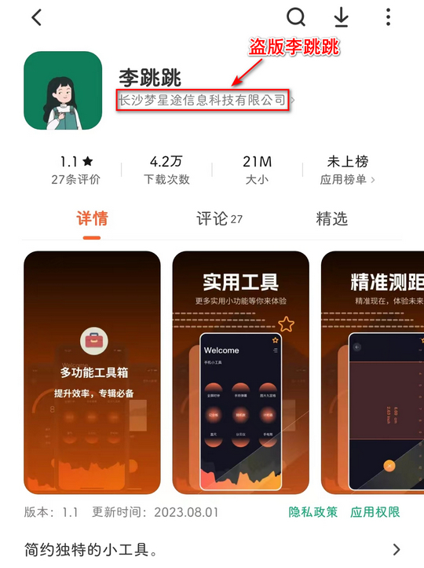

    <h2 align="center">LiTiaotiao-Custom-Rules</h2>

    
    
    
    
    
    
    

# 简介
本项目收集适用于“李跳跳”的 App 自定义规则，包括**基础规则**和**增强规则**。
- 基础规则：关闭应用内广告、更新弹窗、青少年模式弹窗、权限索取提示等
- 增强规则：自动化操作等

# 如何使用

1. 前往 [李跳跳在线规则页面](https://snoopy1866.github.io/LiTiaotiao-Custom-Rules/) 复制规则（[备用链接](https://ossso.github.io/LiTiaotiao-Custom-Rules/)）
2. 打开 “李跳跳”，点击 “更多”，点击右上角三个小点，点击 “导入规则”，长按输入框，选择 “粘贴”，点击“保存”。

⚠ 建议长按输入框，以调用系统自带的粘贴功能，请不要通过第三方 App （例如：输入法、微信等）作为中介进行复制，否则可能会出现规则被截断，粘贴不全导致格式错误的问题。

💡 在线规则页面可以选择复制全部规则或基础规则，本项目的 [Releases页面](https://github.com/Snoopy1866/LiTiaotiao-Custom-Rules/releases) 还提供仅包含增强规则的 [ExtendedRules.json](./ExtendedRules.json) 文件，除此之外，你还可以在 [已适配 App 列表](./AppList.md) 中自行查找单独 App 的规则进行导入。

❌ 一次只能导入一个 json 文件，导入第二个 json 文件后会覆盖前一个 json 文件的规则，而不会追加规则。

🍭 找不到你需要的 App 规则？你可以前往 [Issues](https://github.com/Snoopy1866/LiTiaotiao-Custom-Rules/issues/new/choose) 提交适配需求。

💀 某些 App 的广告布局中的控件不存在任何可以标识的文本（id, desc, text），因此无法为这些 App 书写通用规则。除非在未来的某一天这些 App 为关闭广告按钮增加了可标识的文本（或者广告布局中的其他控件增加了可标识文本且可通过返回键关闭广告），否则这些 App 将不会被本项目所适配。点击查看 [无法适配的 App 列表](./_source/NotSupportedList/NotSupportedList.md)。

🎯 **[FAQ](#faq)**

# Github Star 趋势
<a href="https://star-history.com/#Snoopy1866/LiTiaotiao-Custom-Rules&Date">
  <picture>
    <source media="(prefers-color-scheme: dark)" srcset="https://api.star-history.com/svg?repos=Snoopy1866/LiTiaotiao-Custom-Rules&type=Date&theme=dark" />
    <source media="(prefers-color-scheme: light)" srcset="https://api.star-history.com/svg?repos=Snoopy1866/LiTiaotiao-Custom-Rules&type=Date" />
    
  </picture>
</a>

# 参与贡献
开源项目需要大家共同维护，本项目欢迎任何形式的贡献，请查看 [贡献指南](./CONTRIBUTING.md)。

[贡献者名单](./Contributors.md)

# FAQ

### 01. 如何获取 “李跳跳”?
😢 **2023年8月24日**，李跳跳官方公众号宣布无限期停更。公众号内回复任意内容已经无法获取下载链接，不过还是放上二维码和 logo，认准官方号，谨防上当受骗。

🙏 本项目保留了最新版备份，点击查看：[派大星2.2](./_source/PaiDaXing/)

</img>
</img>

⚠ 目前各大应用商店已经出现了盗版 “李跳跳”，不仅无法跳过广告，反而会弹出广告，请大家不要下载。

⚠ 下图为盗版李跳跳商店页面，请大家注意甄别！！！

</img>

### 02. 如何打开 json 文件？
PC 端使用记事本打开，手机端后缀改为 .txt 打开（或使用 MT 管理器）。

### 03. 规则导入出现格式错误？
请确保复制了 json 文件中的所有内容。在导入规则的输入框中，长按输入框，选择 “粘贴”。
将规则复制到第三方 App（如微信、输入法等）后可能会出现字符串被截断的问题，进而导致从第三方 App 复制到李跳跳时出现 “格式错误”！！！

### 04. 为什么有些规则需要手动触发？
由于 “李跳跳” 仅在 App 界面更新布局时进行检测，因此少数规则需要通过手动更新界面布局才能生效，具体做法有：下拉状态栏、使用手势将 App 切换至后台等，只要实现了界面布局的改变即可切换回 App 界面。需要手动触发的规则在规则详情页中有所标注。

### 05. App 卸载重装后，还需要再次导入规则吗？
**不需要！** 只要你之前有通过 json 文件成功导入某个 App 的规则，那么当这个 App 卸载重装后，只需要打开李跳跳，点击 更多->设置，刷新一次应用列表即可，之前导入的规则依然生效。

强烈建议通过在线规则页面复制所有规则后导入，而不是对每个 App 单独导入规则。如果你不需要那么多 App 的规则，可以手动编辑 json 文件后自行导入。手动编辑需注意 json 文件的结构，每个 App 使用包名的哈希值（可以使用 Java 中的 String.hashCode() 方法获得）作为唯一标识符，你可能需要先生成哈希值，然后在 json 文件中筛选对应的规则。
