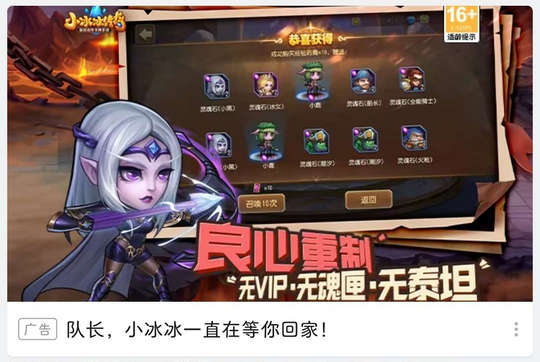
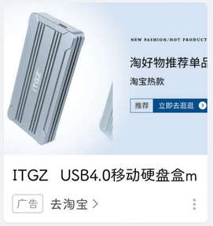

# tv.danmaku.bili（哔哩哔哩）

## 基础规则

快速复制:
```
{"popup_rules":
    [
        {"id":"ic_notice","action":"ic_action"},

        {"id":"+广告","action":"more_icon"},
        {"id":"屏蔽广告","action":"不感兴趣"},
        
        {"id":"+会员购","action":"more_icon"},
        {"id":"屏蔽推广","action":"视频不感兴趣"},
        
        {"id":"corner_hint","action":"more_icon"}
    ]
}
```
详细说明：
- [{"id":"ic_notice","action":"ic_action"}](#idic_noticeactionic_action)
- [{"id":"+广告","action":"more_icon"} - {"id":"屏蔽广告","action":"不感兴趣"}](#id广告actionmore_icon---id屏蔽广告action不感兴趣)
- [{"id":"+会员购","action":"more_icon"} - {"id":"屏蔽推广","action":"视频不感兴趣"}](#id会员购actionmore_icon---id屏蔽推广action视频不感兴趣)
- [{"id":"corner_hint","action":"more_icon"}](#idcorner_hintactionmore_icon)

### {"id":"ic_notice","action":"ic_action"}
关闭 “我的” 页面视频推荐广播通知（⚡ 需要手动触发）


### {"id":"+广告","action":"more_icon"} - {"id":"屏蔽广告","action":"不感兴趣"}
**联合规则**：关闭信息流广告



### {"id":"+会员购","action":"more_icon"} - {"id":"屏蔽推广","action":"视频不感兴趣"}
**联合规则**：关闭会员购广告


### {"id":"corner_hint","action":"more_icon"}
**联合规则**：关闭视频封面广告



## 增强规则
