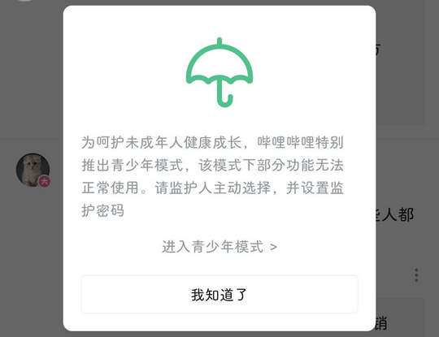

# tv.danmaku.bili（哔哩哔哩）

## 基础规则

快速复制:

```
{"popup_rules":
    [
        {"id":"青少年模式","action":"我知道了"},
    ]
}
```

详细说明：

- [{"id":"ic_notice","action":"ic_action"}](#idic_noticeactionic_action)

### {"id":"青少年模式","action":"我知道了"}

关闭青少年模式弹窗



## 增强规则
